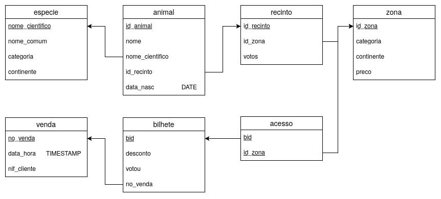

# Projeto BD Zoo

<p align="center">
  
</p>

<p align="center">
  Projeto de Bases de Dados — Zoo
</p>
Este repositório contém as soluções versionadas do grupo para o projeto de Bases de Dados.

#Overview projecto

## Distribuição de Trabalho

| Exercício | Tema                               | Dependências                                                                                 | Responsável |
| --------- | ---------------------------------- | -------------------------------------------------------------------------------------------- | ----------- |
| 1         | Restrições de Integridade          | Base para o resto do projeto; deve estar estabilizado antes do preenchimento final dos dados | Lopes       |
| 2         | Preenchimento da Base de Dados     | Depende das restrições do Exercício 1                                                        | Lopes    |
| 3         | Desenvolvimento da Aplicação Flask | Pode avançar em paralelo, mas necessita de dados para testes completos                       | Esteves     |
| 4         | Engenharia de Dados                | Depende dos dados do Exercício 2                                                             | Santiago    |
| 5         | Consultas Analíticas               | Depende dos dados e da engenharia de dados                                                   | Lopes     |
| 6         | Índices e Otimização               | Depende das consultas finais do Exercício 5                                                  | Lopes       |

### Ordem Recomendada

```text
1 → Restrições de Integridade
2 → Preenchimento da Base de Dados
3 → Aplicação Flask
4 → Engenharia de Dados
5 → Consultas Analíticas
6 → Índices e Otimização
```

### Notas

* O Exercício 1 influencia diretamente o Exercício 2.
* O Exercício 4 depende da existência dos dados gerados no Exercício 2.
* O Exercício 5 utiliza os resultados produzidos no Exercício 4.
* O Exercício 6 apenas deve ser iniciado quando as consultas do Exercício 5 estiverem finalizadas.
* O Exercício 3 pode avançar em paralelo com os restantes, utilizando dados de teste provisórios.


## Objetivo

Este repositório **não substitui** o ambiente Docker fornecido pela cadeira.

A separação de responsabilidades é a seguinte:

* `zoo-project-git/` → código e soluções versionadas
* `app/` e `bdist-workspace/` locais → ambiente de teste
* `entrega-bd-02-GG.ipynb` → documento final de submissão

---

## Estrutura do Repositório

```text
app/                     Aplicação Flask
sql/01_integridade/      RI-1 a RI-4
sql/02_dados/            Inserção de dados
sql/03_engenharia_dados/ Engenharia de dados
sql/04_consultas/        Consultas analíticas
sql/05_indices/          Índices e otimização

tests/                   Testes SQL e aplicação
docs/                    Documentação auxiliar
images/                  Imagens utilizadas no notebook
```

---

## Regra Principal

O notebook oficial **não é utilizado para desenvolvimento**.

As soluções devem ser desenvolvidas primeiro nos ficheiros:

* `.sql`
* `.py`

e apenas no final copiadas para o notebook de entrega.

---

## Como Testar SQL

Copiar os ficheiros SQL deste repositório para o ambiente local:

```text
zoo-project-git/sql/
```

e testar no notebook ou no ambiente Docker da cadeira.

Exemplo:

```sql
-- conteúdo de sql/01_integridade/ri4.sql
```

copiado para a célula correspondente do notebook.

---

## Como Testar Flask

Copiar a pasta:

```text
zoo-project-git/app/
```

para a pasta `app/` do ambiente local.

Depois iniciar o Docker normalmente e aceder a:

```text
http://localhost:8080
```

---

## Workflow Git

O grupo utiliza uma abordagem simples baseada apenas na branch principal (`main`).

Não serão utilizadas branches de funcionalidade.

### Antes de começar a trabalhar

Atualizar o repositório:

```bash
git pull
```

### Depois de alterar ficheiros

Verificar alterações:

```bash
git status
```

Adicionar alterações:

```bash
git add .
```

Criar commit:

```bash
git commit -m "Descrição da alteração"
```

Enviar para o repositório:

```bash
git push
```

### Regra de coordenação

Antes de editar um ficheiro, informar o grupo.

Exemplos:

```text
Estou a trabalhar na RI4.
Estou a trabalhar nas consultas.
Estou a trabalhar na aplicação Flask.
```

Evitar que duas pessoas alterem simultaneamente o mesmo ficheiro.

### Em caso de conflito

Executar:

```bash
git pull
```

resolver manualmente o conflito,

e depois:

```bash
git add .
git commit -m "Resolve merge conflict"
git push
```

### Objetivo

O Git é utilizado principalmente para:

* guardar histórico das soluções;
* partilhar código entre elementos do grupo;
* recuperar versões anteriores quando necessário.

Não é necessário utilizar branches para este projeto.


## Notebook

O ficheiro:

```text
docs/notebook-map.md
```

indica a correspondência entre:

```text
célula do notebook
↓
ficheiro fonte do repositório
```

---

## Entrega Final

A entrega no Fénix deve conter apenas:

```text
entrega-bd-02-GG.zip
├── entrega-bd-02-GG.ipynb
└── app/
```

O conteúdo do notebook será preenchido manualmente a partir dos ficheiros deste repositório.

---

## Fonte de Verdade

Durante todo o projeto:

```text
Fonte de verdade:
    zoo-project-git/

Ambiente de teste:
    app/
    bdist-workspace/

Documento final:
    entrega-bd-02-GG.ipynb
```
